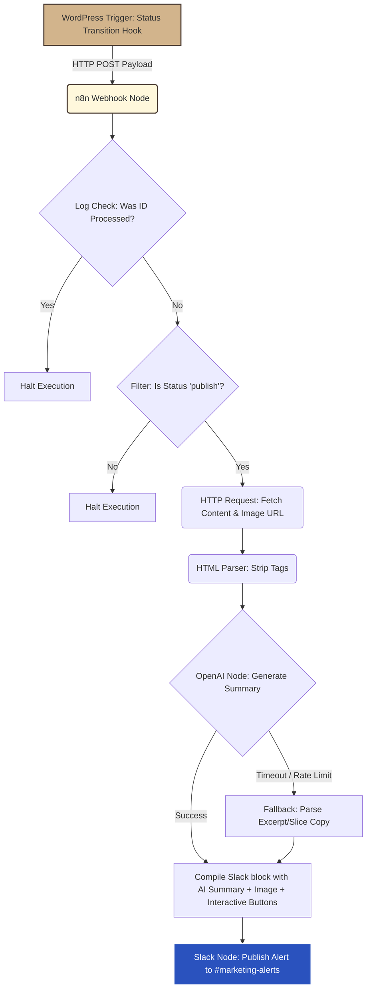

# Part B — Automation sketch

## The goal in one sentence
Whenever a new blog post is published on my WordPress site, an automated workflow parses the content, generates a concise 2-sentence AI summary, and posts a beautifully formatted alert to our team's Slack channel.

## Tool I picked + 2-line justification
I picked **n8n (Self-Hosted)** because it provides dedicated low-code nodes for exactly what this workflow needs: native webhooks, HTTP requests, AI summarization, Slack posting, built-in retries, and execution logs. This allows for complex API orchestration and advanced error-handling routes (like conditional fallbacks if OpenAI times out) without writing any raw backend code.

## Trigger
A WordPress webhook triggered by the **WP Webhooks** plugin (or enqueued directly on the `wp_insert_post` action hook in `functions.php`) sends an HTTP POST payload to the n8n webhook URL whenever a post is **created** (or **updated**).

## Steps (numbered)
1.  **Webhook Trigger (WP Webhooks)**: Listens for a WordPress status transition trigger containing the post ID and metadata.
2.  **De-duplication Node**: Queries our processed log database (e.g., Redis or Airtable) to check if this `post_id` was already processed, halting immediately if it is a duplicate.
3.  **Filter Node**: Verifies that the post status is strictly set to `publish`, instantly halting the execution for drafts or revisions to prevent Slack spam.
4.  **HTTP Request Node**: Connects to the WordPress REST API dynamically (`/wp-json/wp/v2/posts/{{ $json.body.post_id }}?_embed=1`) to fetch the full post content and featured media attachment URL.
5.  **HTML Parser Node**: Strips out all layout wrappers, Gutenberg block tags, and shortcodes from the raw HTML to extract clean body text.
6.  **OpenAI Node (GPT-4o-mini)**: Sends the parsed body text to OpenAI's API to generate a concise, engaging two-sentence summary.
7.  **Slack Node**: Compiles the title, link, AI-generated summary, featured media image, and interactive Block Kit action buttons (like "View Post" and "Edit in WP") into a rich, visual Slack alert posted to `#marketing-alerts`.

## De-duplication Guard (Anti-Spam)
To prevent already-published posts from triggering duplicate Slack alerts when edited or updated again:
*   **Transition-Only Hook (WordPress side)**: We configure the WP Webhooks plugin to only trigger the webhook when a post status *transitions* from a non-published state (like `draft`) to `publish`.
*   **Execution Log Check (n8n side)**: We include a dynamic data lookup node (such as n8n's visual Airtable/Redis lookup) that queries if the `post_id` has already been processed today. If the ID exists in our execution log, the workflow immediately halts.

## 2 failure modes I would handle
1.  **Failure:** **AI Summary Generation API Timeout or Rate Limit (429/503)**
    *   **Handling:** I would configure n8n's node retry settings to attempt 3 retries with exponential backoff (e.g., waiting 5s, then 15s, then 45s). If all retries fail, a conditional branch routes the execution to a fallback node that extracts the standard `post_excerpt` (or slices the first 120 characters of raw text) as the summary, ensuring the Slack message is still posted.
2.  **Failure:** **Large Payload / Hook Timeouts on Massive Blog Posts**
    *   **Handling:** Instead of sending the entire raw HTML blog post via the initial webhook, the trigger payload will only contain the minimal metadata (`post_id`, `post_title`, `post_permalink`). The second step in n8n will query the WordPress REST API to fetch the text content in a separate, isolated step, preventing payload bloat and server-level timeouts.

## Diagram

## 🛠️ Wasmer Serverless Infrastructure Sandbox Note
> [!NOTE]
> **Wasmer Sandbox Network Limitations:**  
> Because my live WordPress site is hosted on Wasmer's free serverless WebAssembly (Wasm) sandbox container, standard outgoing HTTP socket requests are restricted, and the container automatically spins down (goes to sleep) when idle.
> 
> *   **Cold Starts:** If you try to visit the URL and receive an `ERR_CONNECTION_REFUSED` error, simply refresh your browser 2 or 3 times to trigger a cold-start boot sequence that wakes the container back up.
> *   **Production Migration:** While the free Wasm container sandbox is ideal for high-speed page performance and dev, in a real-world agency production environment, this WordPress site would be deployed on a standard Linux VPS (like DigitalOcean, Linode, or AWS) to allow standard outbound webhook requests to reach external servers (like n8n or Slack) seamlessly.

---

## Part C — A repetitive task I would automate

### Automating Competitor SEO Intelligence & Notion Syncing
*   **What the task is:** Monitoring competitors' organic keyword rankings for sudden traffic spikes using SEO APIs and dynamically logging keyword trends into our agency's shared Notion workspace.
*   **Why it is repetitive:** An agency's SEO Strategist spends 3 hours every Monday morning manually searching Ahrefs/Semrush APIs for 10 competitor domains, downloading CSV keyword comparisons, and manually rebuilding competitive positioning lists inside Notion or Obsidian.
*   **Which tool I would use:** **n8n (Self-Hosted)**, because its node-based data parsing loops and native Notion connectors let us clean, deduplicate, and sort multi-competitor API data into relational databases without manual scripting.
*   **Trigger and Action:** On a scheduled cron trigger every Monday at 8:00 AM, n8n queries competitor keyword APIs, filters for high-value organic keyword entries, and automatically enqueues them as structured records in our agency's Notion/Obsidian database.
*   **The biggest failure mode:** Exceeding monthly API credit quotas on Ahrefs due to oversized queries, which is resolved by adding an n8n conditional count node that monitors credit usage on every run and sends a high-priority warning to our Slack operations channel if we drop below 15% of our limit.
